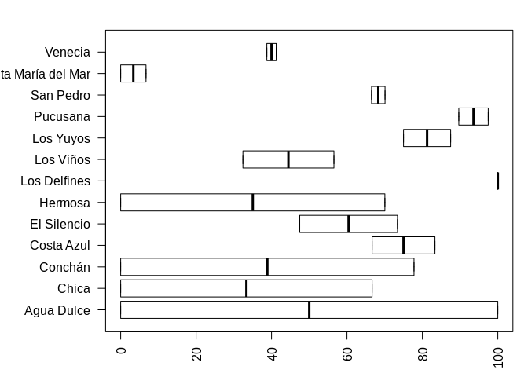
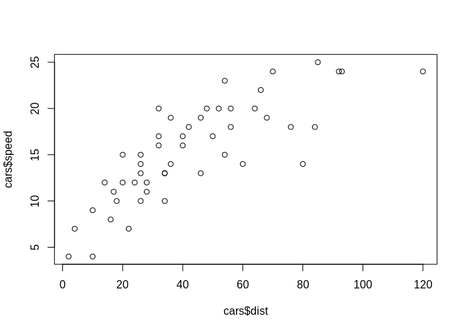

Estadística con R: Código + acción
================
Uriel Torres Zevallos

## Introducción a R

  - R fue creado por Ross Ihaka y Robert Gentleman.
  - Es considerado como un dialecto del lenguaje S creado por los
    laboratorios AT & T Bell.
  - El uso y funcionamiento de R es relativamente intuitivo.
  - R guarda los resultados como un objeto.
  - R resume los resultados en una sola línea, a diferencia de otros
    programas complejos que pueden abrir 20 ventanas.
  - Todo dato es un objeto en R (R es un lenguaje orientado a objetos -
    POO). Orientado a objetos significa que las variables, datos,
    funciones, resultados, etc, se guardan en la memoria activa de la
    pc, bajo la forma de objetos con un nombre específico.
  - \<- (operador asignación).
  - Para que una función sea ejecutada, siempre debe estar acompañada de
    paréntesis, inclusive en el caso de que no haya nada dentro de los
    mismos.  
  - Una función o comando se compone de argumentos o puede carecer de
    comandos, ya sea porque todos estan asignados por defecto o porque
    realmente no tiene argumentos.
  - \[1\] dígito 1, indica que es el primer elemento de x.
  - NOMBRE DE UN OBJETO: debe comenzar con una letra (A- Z o a-z), puede
    incluir letras, dígitos (0-9), y puntos (.). R discrimina entre
    mayúsculas y minúsculas (X y x)
  - Si el objeto ya existe, su valor es borrado y reemplazado.

## Ayuda en línea

``` r
# Acceder mediante Control + 3 a HELP #
# Estructura de la ayuda en línea: 1)descripción, 2) nombre de todos los argumentos, 
# 3)explicación de cada argumento, 4)descripción detallada, 5) valor, 6)anexos, 7)ejemplos#
# para una función o comando dado #
?lm 

# es lo mismo #
help(lm)
help("lm")

# acceso a ayuda con caracteres no convencionales #
help("lm") 
help("*")

# busca la palabra en todas las funciones que la contengan como argumento 
# (en paquetes cargados en la memoria) #
apropos("help") 
```

    ## [1] "help"         "help.request" "help.search"  "help.start"

## Directorio de trabajo

``` r
# para saber cuál es nuestro directorio de trabajo # 
getwd()
```

    ## [1] "/home/thebiologist/Descargas"

``` r
# para cambiar el directorio de trabajo # 
setwd("/home/thebiologist/Descargas")
```

## Comandos fundamentales

``` r
# Uso de punto y coma para separar diferentes comandos en la misma línea #
nombre <- "Carmen"; n1 <- 10; n2 <- 100; m <- 0.5 

# Muestra los objetos en la memoria #
ls() 
```

    ## [1] "m"      "n1"     "n2"     "nombre"

``` r
# Muestra objetos que contengan el caracter m, comando pat (pattern) #
ls(pat = "m") 
```

    ## [1] "m"      "nombre"

``` r
# Objetos que comiencen con el caracter m #
ls(pat = "^m") 
```

    ## [1] "m"

``` r
# Muestra detalles de los objetos de en memoria #
ls.str() 
```

    ## m :  num 0.5
    ## n1 :  num 10
    ## n2 :  num 100
    ## nombre :  chr "Carmen"

``` r
# Función rm(), elimina objeto (x), (x,y), elimina x y #
# rm(list = ls()), elimina todos los objetos en la memoria #
rm(x)
```

    ## Warning in rm(x): objeto 'x' no encontrado

``` r
# Para borrar los objetos que empiecen con la letra m # 
rm(list = ls(pat = "^m")) 

# Para verificar la clase del objeto #
class(iris) 
```

    ## [1] "data.frame"

``` r
# Para ver el número de filas y columnas...
# El primer número es: fila (observaciones), 
# Segundo: columnas (variables) #
dim(iris) 
```

    ## [1] 150   5

``` r
# Para ver el número de filas #
nrow(iris) 
```

    ## [1] 150

``` r
# Para ver el número de columnas #
ncol(iris) 
```

    ## [1] 5

``` r
# Para ver el nombre de las variables #
names(iris) 
```

    ## [1] "Sepal.Length" "Sepal.Width"  "Petal.Length" "Petal.Width" 
    ## [5] "Species"

``` r
# para ver la base de datos#
View(iris) 

# Para observar una vista previa de la parte superior del dataframe (primeras 6 filas) #
head(iris)
```

    ##   Sepal.Length Sepal.Width Petal.Length Petal.Width Species
    ## 1          5.1         3.5          1.4         0.2  setosa
    ## 2          4.9         3.0          1.4         0.2  setosa
    ## 3          4.7         3.2          1.3         0.2  setosa
    ## 4          4.6         3.1          1.5         0.2  setosa
    ## 5          5.0         3.6          1.4         0.2  setosa
    ## 6          5.4         3.9          1.7         0.4  setosa

``` r
# Para observar las primeras 10 filas del dataframe #
head(iris, 10)
```

    ##    Sepal.Length Sepal.Width Petal.Length Petal.Width Species
    ## 1           5.1         3.5          1.4         0.2  setosa
    ## 2           4.9         3.0          1.4         0.2  setosa
    ## 3           4.7         3.2          1.3         0.2  setosa
    ## 4           4.6         3.1          1.5         0.2  setosa
    ## 5           5.0         3.6          1.4         0.2  setosa
    ## 6           5.4         3.9          1.7         0.4  setosa
    ## 7           4.6         3.4          1.4         0.3  setosa
    ## 8           5.0         3.4          1.5         0.2  setosa
    ## 9           4.4         2.9          1.4         0.2  setosa
    ## 10          4.9         3.1          1.5         0.1  setosa

``` r
# Para ver una vista previa del final del dataframe #
tail(iris)
```

    ##     Sepal.Length Sepal.Width Petal.Length Petal.Width   Species
    ## 145          6.7         3.3          5.7         2.5 virginica
    ## 146          6.7         3.0          5.2         2.3 virginica
    ## 147          6.3         2.5          5.0         1.9 virginica
    ## 148          6.5         3.0          5.2         2.0 virginica
    ## 149          6.2         3.4          5.4         2.3 virginica
    ## 150          5.9         3.0          5.1         1.8 virginica

``` r
# Para observar las ultimas 15 filas del dataframe #
tail(iris, 15) 
```

    ##     Sepal.Length Sepal.Width Petal.Length Petal.Width   Species
    ## 136          7.7         3.0          6.1         2.3 virginica
    ## 137          6.3         3.4          5.6         2.4 virginica
    ## 138          6.4         3.1          5.5         1.8 virginica
    ## 139          6.0         3.0          4.8         1.8 virginica
    ## 140          6.9         3.1          5.4         2.1 virginica
    ## 141          6.7         3.1          5.6         2.4 virginica
    ## 142          6.9         3.1          5.1         2.3 virginica
    ## 143          5.8         2.7          5.1         1.9 virginica
    ## 144          6.8         3.2          5.9         2.3 virginica
    ## 145          6.7         3.3          5.7         2.5 virginica
    ## 146          6.7         3.0          5.2         2.3 virginica
    ## 147          6.3         2.5          5.0         1.9 virginica
    ## 148          6.5         3.0          5.2         2.0 virginica
    ## 149          6.2         3.4          5.4         2.3 virginica
    ## 150          5.9         3.0          5.1         1.8 virginica

``` r
# Resumen de los datos, además de la cantidad de NAs #
# Para las variables categóricas (factor) se muestra el número de veces que cada "nivel" aparece (FRECUENCIA) en los datos #
summary(iris) 
```

    ##   Sepal.Length    Sepal.Width     Petal.Length    Petal.Width   
    ##  Min.   :4.300   Min.   :2.000   Min.   :1.000   Min.   :0.100  
    ##  1st Qu.:5.100   1st Qu.:2.800   1st Qu.:1.600   1st Qu.:0.300  
    ##  Median :5.800   Median :3.000   Median :4.350   Median :1.300  
    ##  Mean   :5.843   Mean   :3.057   Mean   :3.758   Mean   :1.199  
    ##  3rd Qu.:6.400   3rd Qu.:3.300   3rd Qu.:5.100   3rd Qu.:1.800  
    ##  Max.   :7.900   Max.   :4.400   Max.   :6.900   Max.   :2.500  
    ##        Species  
    ##  setosa    :50  
    ##  versicolor:50  
    ##  virginica :50  
    ##                 
    ##                 
    ## 

``` r
# Para ver el resúmen de la variable Species, dado que es categórica, te indica cuántas veces ocurre #
table(iris$Species) 
```

    ## 
    ##     setosa versicolor  virginica 
    ##         50         50         50

``` r
# Cantidad de observaciones y variables, tipo de variable y una vista previa de su contenido #
str(iris) 
```

    ## 'data.frame':    150 obs. of  5 variables:
    ##  $ Sepal.Length: num  5.1 4.9 4.7 4.6 5 5.4 4.6 5 4.4 4.9 ...
    ##  $ Sepal.Width : num  3.5 3 3.2 3.1 3.6 3.9 3.4 3.4 2.9 3.1 ...
    ##  $ Petal.Length: num  1.4 1.4 1.3 1.5 1.4 1.7 1.4 1.5 1.4 1.5 ...
    ##  $ Petal.Width : num  0.2 0.2 0.2 0.2 0.2 0.4 0.3 0.2 0.2 0.1 ...
    ##  $ Species     : Factor w/ 3 levels "setosa","versicolor",..: 1 1 1 1 1 1 1 1 1 1 ...

## Teoría y creación de objetos (variables) de R

  - R trabaja con objetos (tienen nombre y contenido), pero también con
    atributos, que especifican el tipo de dato representado por el
    objeto. Todo objeto tiene dos atributos intrínsectos: **tipo** y
    **longitud**.
  - **Tipo: numérico, caracter, lógico y complejo.**
  - **Longitud: número de elementos en el objeto.**

<!-- end list -->

1.  **Vector** puede ser numérico, caracter, complejo o lógico, no se
    permite varios tipos en el mismo objeto.
2.  **Factor** puede ser numérico o caracter, no se permite varios tipos
    en el mismo objeto, un factor suele ser una variable categórica.
3.  **Arreglo**, puede ser numérico, caracter, complejo, lógico, no se
    permite varios tipos en el mismo objeto, suele ser una tabla de
    dimensión k.
4.  **Matriz** puede ser numérico, caracter, complejo, lógico, no se
    permite varios tipos en el mismo objeto, suele ser un arreglo de
    dimensión k. = 2,
5.  **Data.frame** (base de datos) puede ser numérico, caracter,
    complejo, lógico, si permite varios tipos en el mismo objeto, suele
    ser tabla compuesta de una o más vectores y/o fatores de la mismo
    longitud, que pueden ser de diferentes tipos.
6.  **ts (serie temporal)**
7.  **Lista**

<!-- end list -->

``` r
x <- 1

# Tener en consideración que mode y class son diferentes #
mode(x)
```

    ## [1] "numeric"

``` r
length(x)
```

    ## [1] 1

``` r
A <- "Gomphotherium"
mode(A)
```

    ## [1] "character"

``` r
compar <- TRUE
mode(compar)
```

    ## [1] "logical"

``` r
z <- 1i
mode(z)
```

    ## [1] "complex"

``` r
vector(mode = "numeric", length = 90)
```

    ##  [1] 0 0 0 0 0 0 0 0 0 0 0 0 0 0 0 0 0 0 0 0 0 0 0 0 0 0 0 0 0 0 0 0 0 0 0
    ## [36] 0 0 0 0 0 0 0 0 0 0 0 0 0 0 0 0 0 0 0 0 0 0 0 0 0 0 0 0 0 0 0 0 0 0 0
    ## [71] 0 0 0 0 0 0 0 0 0 0 0 0 0 0 0 0 0 0 0 0

``` r
vector(mode = "logical", length = 44)
```

    ##  [1] FALSE FALSE FALSE FALSE FALSE FALSE FALSE FALSE FALSE FALSE FALSE
    ## [12] FALSE FALSE FALSE FALSE FALSE FALSE FALSE FALSE FALSE FALSE FALSE
    ## [23] FALSE FALSE FALSE FALSE FALSE FALSE FALSE FALSE FALSE FALSE FALSE
    ## [34] FALSE FALSE FALSE FALSE FALSE FALSE FALSE FALSE FALSE FALSE FALSE

``` r
vector(mode = "character", length = 200)
```

    ##   [1] "" "" "" "" "" "" "" "" "" "" "" "" "" "" "" "" "" "" "" "" "" "" ""
    ##  [24] "" "" "" "" "" "" "" "" "" "" "" "" "" "" "" "" "" "" "" "" "" "" ""
    ##  [47] "" "" "" "" "" "" "" "" "" "" "" "" "" "" "" "" "" "" "" "" "" "" ""
    ##  [70] "" "" "" "" "" "" "" "" "" "" "" "" "" "" "" "" "" "" "" "" "" "" ""
    ##  [93] "" "" "" "" "" "" "" "" "" "" "" "" "" "" "" "" "" "" "" "" "" "" ""
    ## [116] "" "" "" "" "" "" "" "" "" "" "" "" "" "" "" "" "" "" "" "" "" "" ""
    ## [139] "" "" "" "" "" "" "" "" "" "" "" "" "" "" "" "" "" "" "" "" "" "" ""
    ## [162] "" "" "" "" "" "" "" "" "" "" "" "" "" "" "" "" "" "" "" "" "" "" ""
    ## [185] "" "" "" "" "" "" "" "" "" "" "" "" "" "" "" ""

``` r
numeric(length = 20)
```

    ##  [1] 0 0 0 0 0 0 0 0 0 0 0 0 0 0 0 0 0 0 0 0

``` r
logical(length = 20)
```

    ##  [1] FALSE FALSE FALSE FALSE FALSE FALSE FALSE FALSE FALSE FALSE FALSE
    ## [12] FALSE FALSE FALSE FALSE FALSE FALSE FALSE FALSE FALSE

``` r
character(200)
```

    ##   [1] "" "" "" "" "" "" "" "" "" "" "" "" "" "" "" "" "" "" "" "" "" "" ""
    ##  [24] "" "" "" "" "" "" "" "" "" "" "" "" "" "" "" "" "" "" "" "" "" "" ""
    ##  [47] "" "" "" "" "" "" "" "" "" "" "" "" "" "" "" "" "" "" "" "" "" "" ""
    ##  [70] "" "" "" "" "" "" "" "" "" "" "" "" "" "" "" "" "" "" "" "" "" "" ""
    ##  [93] "" "" "" "" "" "" "" "" "" "" "" "" "" "" "" "" "" "" "" "" "" "" ""
    ## [116] "" "" "" "" "" "" "" "" "" "" "" "" "" "" "" "" "" "" "" "" "" "" ""
    ## [139] "" "" "" "" "" "" "" "" "" "" "" "" "" "" "" "" "" "" "" "" "" "" ""
    ## [162] "" "" "" "" "" "" "" "" "" "" "" "" "" "" "" "" "" "" "" "" "" "" ""
    ## [185] "" "" "" "" "" "" "" "" "" "" "" "" "" "" "" ""

``` r
factor(1:3)
```

    ## [1] 1 2 3
    ## Levels: 1 2 3

``` r
factor(1:3, labels = c("A", "B", "C"))
```

    ## [1] A B C
    ## Levels: A B C

``` r
factor(10:50, exclude = 12)
```

    ##  [1] 10   11   <NA> 13   14   15   16   17   18   19   20   21   22   23  
    ## [15] 24   25   26   27   28   29   30   31   32   33   34   35   36   37  
    ## [29] 38   39   40   41   42   43   44   45   46   47   48   49   50  
    ## 40 Levels: 10 11 13 14 15 16 17 18 19 20 21 22 23 24 25 26 27 28 29 ... 50

``` r
factor(1:20, exclude = c(2,3,4,5,6,7))
```

    ##  [1] 1    <NA> <NA> <NA> <NA> <NA> <NA> 8    9    10   11   12   13   14  
    ## [15] 15   16   17   18   19   20  
    ## Levels: 1 8 9 10 11 12 13 14 15 16 17 18 19 20

``` r
# levels selecciona a los niveles del factor que esten entre 2 y 5 #
factoruriel <- factor(c(2,10), levels = 2:5) 

# solo aparece desde el 2 al 5, ya que el 7 no esta entre 2 y 5 #
factoruriel
```

    ## [1] 2    <NA>
    ## Levels: 2 3 4 5

``` r
levels(factoruriel)
```

    ## [1] "2" "3" "4" "5"

``` r
factoruriel <- factor(c(2,10,3,4,5,10,10), levels = 2:5)

factoruriel
```

    ## [1] 2    <NA> 3    4    5    <NA> <NA>
    ## Levels: 2 3 4 5

``` r
matrix(1:40, 4, 10, byrow = T)
```

    ##      [,1] [,2] [,3] [,4] [,5] [,6] [,7] [,8] [,9] [,10]
    ## [1,]    1    2    3    4    5    6    7    8    9    10
    ## [2,]   11   12   13   14   15   16   17   18   19    20
    ## [3,]   21   22   23   24   25   26   27   28   29    30
    ## [4,]   31   32   33   34   35   36   37   38   39    40

``` r
matrix(1:40, 4, 10, byrow = F)
```

    ##      [,1] [,2] [,3] [,4] [,5] [,6] [,7] [,8] [,9] [,10]
    ## [1,]    1    5    9   13   17   21   25   29   33    37
    ## [2,]    2    6   10   14   18   22   26   30   34    38
    ## [3,]    3    7   11   15   19   23   27   31   35    39
    ## [4,]    4    8   12   16   20   24   28   32   36    40

``` r
matrix(20:40, 2, 10)
```

    ## Warning in matrix(20:40, 2, 10): la longitud de los datos [21] no es un
    ## submúltiplo o múltiplo del número de filas [2] en la matriz

    ##      [,1] [,2] [,3] [,4] [,5] [,6] [,7] [,8] [,9] [,10]
    ## [1,]   20   22   24   26   28   30   32   34   36    38
    ## [2,]   21   23   25   27   29   31   33   35   37    39

``` r
x <- 1:20

x
```

    ##  [1]  1  2  3  4  5  6  7  8  9 10 11 12 13 14 15 16 17 18 19 20

``` r
dim(x) <- c(5,4) #5 filas y 4 columnas se ubica valores de 1 a 20.

x
```

    ##      [,1] [,2] [,3] [,4]
    ## [1,]    1    6   11   16
    ## [2,]    2    7   12   17
    ## [3,]    3    8   13   18
    ## [4,]    4    9   14   19
    ## [5,]    5   10   15   20

``` r
dim(x)
```

    ## [1] 5 4

``` r
x <- 1:4; n <- 10; M <- c(10,35); y = 2:4

data.frame(x, n)
```

    ##   x  n
    ## 1 1 10
    ## 2 2 10
    ## 3 3 10
    ## 4 4 10

``` r
data.frame(x, n)
```

    ##   x  n
    ## 1 1 10
    ## 2 2 10
    ## 3 3 10
    ## 4 4 10

``` r
data.frame(x, M)
```

    ##   x  M
    ## 1 1 10
    ## 2 2 35
    ## 3 3 10
    ## 4 4 35

``` r
data.frame(n, y)
```

    ##    n y
    ## 1 10 2
    ## 2 10 3
    ## 3 10 4

``` r
data.frame(M, x)
```

    ##    M x
    ## 1 10 1
    ## 2 35 2
    ## 3 10 3
    ## 4 35 4

``` r
data.frame("Unidad de análisis" = x, "Valor" = n)
```

    ##   Unidad.de.análisis Valor
    ## 1                  1    10
    ## 2                  2    10
    ## 3                  3    10
    ## 4                  4    10

``` r
L1 <- list(x, y)

L2 <- list(A = x, B = y)

L1
```

    ## [[1]]
    ## [1] 1 2 3 4
    ## 
    ## [[2]]
    ## [1] 2 3 4

``` r
L2
```

    ## $A
    ## [1] 1 2 3 4
    ## 
    ## $B
    ## [1] 2 3 4

``` r
ts(1:10, start = 1959)
```

    ## Time Series:
    ## Start = 1959 
    ## End = 1968 
    ## Frequency = 1 
    ##  [1]  1  2  3  4  5  6  7  8  9 10

``` r
ts(3:20, frequency = 4, start = c(1959,5))
```

    ##      Qtr1 Qtr2 Qtr3 Qtr4
    ## 1960    3    4    5    6
    ## 1961    7    8    9   10
    ## 1962   11   12   13   14
    ## 1963   15   16   17   18
    ## 1964   19   20

``` r
ts(1:10, frequency = 12, start = c(2018, 3))
```

    ##      Mar Apr May Jun Jul Aug Sep Oct Nov Dec
    ## 2018   1   2   3   4   5   6   7   8   9  10

``` r
ts(matrix(rpois(36, 5), 12, 3), start = c(1999, 2), frequency = 12)
```

    ##          Series 1 Series 2 Series 3
    ## Feb 1999        2        6        6
    ## Mar 1999        4        5        0
    ## Apr 1999        8        3        5
    ## May 1999        3        3        5
    ## Jun 1999        3        8        9
    ## Jul 1999        5        2       11
    ## Aug 1999        1        1        2
    ## Sep 1999        4        4        5
    ## Oct 1999        5        5        0
    ## Nov 1999        3        4        7
    ## Dec 1999        9        7        4
    ## Jan 2000        2        2        7

``` r
ts(matrix(rnorm(20, mean = 20, sd =5), 4, 6), start = c (2018,1), frequency = 1)
```

    ## Warning in matrix(rnorm(20, mean = 20, sd = 5), 4, 6): la longitud de los
    ## datos [20] no es un submúltiplo o múltiplo del número de columnas [6] en la
    ## matriz

    ## Time Series:
    ## Start = 2018 
    ## End = 2021 
    ## Frequency = 1 
    ##      Series 1 Series 2 Series 3 Series 4 Series 5 Series 6
    ## 2018 22.98411 25.85904 24.55828 14.62543 19.31434 22.98411
    ## 2019 20.53863 29.23188 22.98321 18.85009 14.14608 20.53863
    ## 2020 16.50618 15.01859 18.49106 13.66464 16.55371 16.50618
    ## 2021 25.16132 24.01878 21.56729 20.03155 21.77500 25.16132

``` r
ts(matrix(rnorm(20, mean = 20, sd =5), 4, 6), start = c (2018,1), frequency = 5)
```

    ## Warning in matrix(rnorm(20, mean = 20, sd = 5), 4, 6): la longitud de los
    ## datos [20] no es un submúltiplo o múltiplo del número de columnas [6] en la
    ## matriz

    ## Time Series:
    ## Start = c(2018, 1) 
    ## End = c(2018, 4) 
    ## Frequency = 5 
    ##        Series 1 Series 2 Series 3 Series 4 Series 5 Series 6
    ## 2018.0 18.41614 24.53344 18.34190 20.89939 13.31917 18.41614
    ## 2018.2 20.59546 19.37464 19.89459 25.96454 24.01466 20.59546
    ## 2018.4 26.33470 13.11216 29.27885 21.60828 25.12022 26.33470
    ## 2018.6 14.36310 18.15704 27.65663 22.65938 19.54939 14.36310

## Estadígrafos descriptivos

``` r
# operador ":" tiene prioridad sobre otros operadores aritméticos #
# función rnorm(1), genera un dato al azar de una distribución normal, con media 0 y varianza 1 #
n <- 3 + rnorm(1); print(n)
```

    ## [1] 2.261445

``` r
# onjeto no guardado en la memoria # 
(10 + 2)*5
```

    ## [1] 60

``` r
x <- c(1:30)

sqrt(144)
```

    ## [1] 12

``` r
# Suma todos los elementos de x #
sum(x)
```

    ## [1] 465

``` r
# Producto de los elementos de x #
prod(x) 
```

    ## [1] 2.652529e+32

``` r
# Valor máximo en el objeto x #
max(x) 
```

    ## [1] 30

``` r
# Valor mínimo en el objeto x #
min(x) 
```

    ## [1] 1

``` r
# Unidad del elemento máximo de x #
which.max(x) 
```

    ## [1] 30

``` r
# Unidad del elemento mínimo de x #
which.min(x) 
```

    ## [1] 1

``` r
# Para ver el min y max (único comando que genera un vector de longitud 2 #
range(x)
```

    ## [1]  1 30

``` r
# Para ver el min y max #
c(min(x), max(x)) 
```

    ## [1]  1 30

``` r
# Número de elementos en x #
length(x) 
```

    ## [1] 30

``` r
# Promedio de los elementos de x #
mean(x) 
```

    ## [1] 15.5

``` r
# Mediana de los elementos de x #
median(x) 
```

    ## [1] 15.5

``` r
# Varianza de los elementos de x #

var(x)
```

    ## [1] 77.5

``` r
y <- matrix(1:20, 4, 5)

# Matriz de correlación de x (siempre y cuando sea matriz o marco de datos) #
cor(y)
```

    ##      [,1] [,2] [,3] [,4] [,5]
    ## [1,]    1    1    1    1    1
    ## [2,]    1    1    1    1    1
    ## [3,]    1    1    1    1    1
    ## [4,]    1    1    1    1    1
    ## [5,]    1    1    1    1    1

``` r
a <- c(1, 2, 3, 4, 5, 6, 7, 8, 9)
b <- c(1, 2, 4, 1, 6, 7, 1, 9, 10)

# Correlación lineal entre x y z
cor(a, b)
```

    ## [1] 0.7278243

## Manejo y control de datos (incluído NA & outlier)

``` r
vector <- c(2.2222, 2.4444, 2.44444, 23.2222, 223.4455, 12.2222)

data("iris")

# Para seleccionar variables (columnas) en este caso de 1 a 4 #
irisnew <- iris[c(1:4)]
str(irisnew)
```

    ## 'data.frame':    150 obs. of  4 variables:
    ##  $ Sepal.Length: num  5.1 4.9 4.7 4.6 5 5.4 4.6 5 4.4 4.9 ...
    ##  $ Sepal.Width : num  3.5 3 3.2 3.1 3.6 3.9 3.4 3.4 2.9 3.1 ...
    ##  $ Petal.Length: num  1.4 1.4 1.3 1.5 1.4 1.7 1.4 1.5 1.4 1.5 ...
    ##  $ Petal.Width : num  0.2 0.2 0.2 0.2 0.2 0.4 0.3 0.2 0.2 0.1 ...

``` r
# Para descartar variables (columnas) en este caso de 1 a 4 #
irisnew1 <- iris[-c(1:4)]
str(irisnew1)
```

    ## 'data.frame':    150 obs. of  1 variable:
    ##  $ Species: Factor w/ 3 levels "setosa","versicolor",..: 1 1 1 1 1 1 1 1 1 1 ...

``` r
# Redondea los elementos de "vector" a 3 decimales #
round(vector, 3) 
```

    ## [1]   2.222   2.444   2.444  23.222 223.446  12.222

``` r
# Invierte el orden de los elementos en "vector" #
rev(vector)
```

    ## [1]  12.22220 223.44550  23.22220   2.44444   2.44440   2.22220

``` r
# Ordena los elementos de "vector" en orden ascendente #
sort(vector)
```

    ## [1]   2.22220   2.44440   2.44444  12.22220  23.22220 223.44550

``` r
# Ordena los elementos de "vector" en orden descendente # 
rev(sort(vector)) 
```

    ## [1] 223.44550  23.22220  12.22220   2.44444   2.44440   2.22220

``` r
# Asigna el orden de menor a mayor según números #
rank(vector)
```

    ## [1] 1 2 3 5 6 4

``` r
# Calcular logaritmo de "vector", en base 10 #
log(vector, base = 10) 
```

    ## [1] 0.3467831 0.3881723 0.3881794 1.3659034 2.3491716 1.0871494

``` r
x <- 1:10
y <- 1:20

# Genera un vector con los elementos de x que estan presentes en y #
match(x, y)
```

    ##  [1]  1  2  3  4  5  6  7  8  9 10

``` r
# Número de combinacions de choose (n, k) k eventos en n repeticiones#
choose(9, 7)
```

    ## [1] 36

``` r
x <- c(NA, NA, 2, 4, 5, 6, 7)
# Elimina las observaciones con datos ausentes (NA) 
# Elimina la fila si x es una matriz o marco de datos #
na.omit(x) 
```

    ## [1] 2 4 5 6 7
    ## attr(,"na.action")
    ## [1] 1 2
    ## attr(,"class")
    ## [1] "omit"

``` r
z <- c(1, 1, 1, 1, 12, 31, 123, 323, 412, 412, 412, 412)

# Suprime elementos duplicados #
unique(z) 
```

    ## [1]   1  12  31 123 323 412

``` r
# Genera tabla con valores y frecuencia #
table(z)
```

    ## z
    ##   1  12  31 123 323 412 
    ##   4   1   1   1   1   4

``` r
# Extrae valores con un criterio #
subset(z, z < 30) 
```

    ## [1]  1  1  1  1 12

``` r
matriz <- matrix(20, 4, 5) 
# Extrae columna 1 y 2, argumento select #
subset(matriz, select = c(1,2)) 
```

    ##      [,1] [,2]
    ## [1,]   20   20
    ## [2,]   20   20
    ## [3,]   20   20
    ## [4,]   20   20

``` r
x <- c(1:100)
# Muestreo aleatorio simple de la variable x, tamaño 10
# sin repetición replace = F, con repetición replace = T # 
sample(x, size = 10, replace = F) 
```

    ##  [1] 57 53 48  4 87 72 34 98 28 46

``` r
# OJO: PRIMERO ELIMINAR LOS OUTLIERS LUEGO LOS NAS #
# Filtrado de datos: NAs

library(readxl)
# La base de datos importada tiene 9 NAs # 
data <- read_excel("Bases de datos (Compilación).xls",  sheet = "NA&outlier")
data
```

    ## # A tibble: 39 x 5
    ##       id chereal temperatura densidad humedad
    ##    <dbl>   <dbl>       <dbl>    <dbl>   <dbl>
    ##  1     1       1          NA       12       4
    ##  2     2       1          14       24     100
    ##  3     3       5          15       17      49
    ##  4     4       4          15       24      35
    ##  5     5      NA          27       23      38
    ##  6     6      NA          24       25      40
    ##  7     7      NA          22       23      45
    ##  8     8      NA          18       24      51
    ##  9     9      NA          25       14      17
    ## 10    10       3          21       30      64
    ## # … with 29 more rows

``` r
# Elimina las filas que contengan NAs #
datos_sin_na <- data[complete.cases(data), ]
datos_sin_na
```

    ## # A tibble: 30 x 5
    ##       id chereal temperatura densidad humedad
    ##    <dbl>   <dbl>       <dbl>    <dbl>   <dbl>
    ##  1     2       1          14       24     100
    ##  2     3       5          15       17      49
    ##  3     4       4          15       24      35
    ##  4    10       3          21       30      64
    ##  5    11       1          19       23      90
    ##  6    15       5          22       21      41
    ##  7    16       4          27       10      51
    ##  8    17       2          20       30      32
    ##  9    18       3          14       30      85
    ## 10    19       4          18       27      56
    ## # … with 20 more rows

``` r
# Elimina todos los NAs que se ubiquen entre la fila 5 a la fila 9 #
datos_sin_na1 <- data[complete.cases(data[5:9, ]), ]
```

    ## Warning: Length of logical index must be 1 or 39, not 5

``` r
datos_sin_na1
```

    ## # A tibble: 0 x 5
    ## # … with 5 variables: id <dbl>, chereal <dbl>, temperatura <dbl>,
    ## #   densidad <dbl>, humedad <dbl>

``` r
# Elimina todos los NAs, indiferentemente de filas o columnas #
datos_sin_na2 <- na.omit(data) 
datos_sin_na2
```

    ## # A tibble: 30 x 5
    ##       id chereal temperatura densidad humedad
    ##    <dbl>   <dbl>       <dbl>    <dbl>   <dbl>
    ##  1     2       1          14       24     100
    ##  2     3       5          15       17      49
    ##  3     4       4          15       24      35
    ##  4    10       3          21       30      64
    ##  5    11       1          19       23      90
    ##  6    15       5          22       21      41
    ##  7    16       4          27       10      51
    ##  8    17       2          20       30      32
    ##  9    18       3          14       30      85
    ## 10    19       4          18       27      56
    ## # … with 20 more rows

``` r
# Identifica los NAs y te proporciona un vector lógico (T or F) 
# con valores que indican si hay algún NA en las filas #
fila_na <- apply(data, 1, function(x){any(is.na(x))}) 
fila_na
```

    ##  [1]  TRUE FALSE FALSE FALSE  TRUE  TRUE  TRUE  TRUE  TRUE FALSE FALSE
    ## [12]  TRUE  TRUE  TRUE FALSE FALSE FALSE FALSE FALSE FALSE FALSE FALSE
    ## [23] FALSE FALSE FALSE FALSE FALSE FALSE FALSE FALSE FALSE FALSE FALSE
    ## [34] FALSE FALSE FALSE FALSE FALSE FALSE

``` r
# Cuantifica cuantos NAs hay por filas #
sum(fila_na)
```

    ## [1] 9

``` r
# Elimina los NAs #
datos_sin_na3 <- data[!fila_na,] 
datos_sin_na3
```

    ## # A tibble: 30 x 5
    ##       id chereal temperatura densidad humedad
    ##    <dbl>   <dbl>       <dbl>    <dbl>   <dbl>
    ##  1     2       1          14       24     100
    ##  2     3       5          15       17      49
    ##  3     4       4          15       24      35
    ##  4    10       3          21       30      64
    ##  5    11       1          19       23      90
    ##  6    15       5          22       21      41
    ##  7    16       4          27       10      51
    ##  8    17       2          20       30      32
    ##  9    18       3          14       30      85
    ## 10    19       4          18       27      56
    ## # … with 20 more rows

``` r
library(tidyr)
library(dplyr)
```

    ## 
    ## Attaching package: 'dplyr'

    ## The following objects are masked from 'package:stats':
    ## 
    ##     filter, lag

    ## The following objects are masked from 'package:base':
    ## 
    ##     intersect, setdiff, setequal, union

``` r
# Elimina los NAs usando el paquete tidyr# 
data %>% drop_na() 
```

    ## # A tibble: 30 x 5
    ##       id chereal temperatura densidad humedad
    ##    <dbl>   <dbl>       <dbl>    <dbl>   <dbl>
    ##  1     2       1          14       24     100
    ##  2     3       5          15       17      49
    ##  3     4       4          15       24      35
    ##  4    10       3          21       30      64
    ##  5    11       1          19       23      90
    ##  6    15       5          22       21      41
    ##  7    16       4          27       10      51
    ##  8    17       2          20       30      32
    ##  9    18       3          14       30      85
    ## 10    19       4          18       27      56
    ## # … with 20 more rows

``` r
# Elimina los NAs para las columnas: temperatura y densidad #
# Tener en cuenta que solo debe ir el nombre de la variable, no se debe usar $ # 
datosfiltrados <- data %>% drop_na(temperatura, densidad)
datosfiltrados
```

    ## # A tibble: 35 x 5
    ##       id chereal temperatura densidad humedad
    ##    <dbl>   <dbl>       <dbl>    <dbl>   <dbl>
    ##  1     2       1          14       24     100
    ##  2     3       5          15       17      49
    ##  3     4       4          15       24      35
    ##  4     5      NA          27       23      38
    ##  5     6      NA          24       25      40
    ##  6     7      NA          22       23      45
    ##  7     8      NA          18       24      51
    ##  8     9      NA          25       14      17
    ##  9    10       3          21       30      64
    ## 10    11       1          19       23      90
    ## # … with 25 more rows

``` r
# Filtrado de datos: Outliers #
# Generamos una base de datos # 
variable1 <- c(10, 13, 15, 19, 20, 120, 12, 19, 11, 10, 12, 23, 12)
variable2 <- c(12, 33, 14, 15, 12, 21, 110, 95, 29, 11, 10, 9, 8)
variable3 <- c(10, 11, 13, 19, 12, 130, 140, 19, 11, 10, 9, 8, 7)
data1 <- data.frame(variable1, variable2, variable3)

# Criterio para establecer límites de valores atípicos #
# Rango intercuartílico (RIQ): Q3 - Q1 #
# Q3 + 1.5 * IQR #
# Q1 - 1.5 * IQR #

# Comprobando... #
# fivenum te entrega los datos de un boxplot (min, cuartil1, mediana, cuartil3, máx) #
fivenum(data1$variable2)
```

    ## [1]   8  11  14  29 110

``` r
29 + 1.5* (29 - 11)
```

    ## [1] 56

``` r
11 - 1.5* (29 - 11)
```

    ## [1] -16

``` r
# Identifica los outliers en un vector # 
# No genera un boxplot (plot = F) #
outliers <- boxplot(data1$variable2, plot = FALSE)$out 

# Elimina las filas que contienen los outliers de la variable2 #
data_sin_outlier <- data1[-which(data1$variable2 %in% outliers),]
data_sin_outlier
```

    ##    variable1 variable2 variable3
    ## 1         10        12        10
    ## 2         13        33        11
    ## 3         15        14        13
    ## 4         19        15        19
    ## 5         20        12        12
    ## 6        120        21       130
    ## 9         11        29        11
    ## 10        10        11        10
    ## 11        12        10         9
    ## 12        23         9         8
    ## 13        12         8         7

``` r
# Los valores deben estar entre -16 y 56 #
fivenum(data_sin_outlier$variable2)
```

    ## [1]  8.0 10.5 12.0 18.0 33.0

``` r
# Identificar los outliers (puntito extremo) en un boxplot para la variable 1 y 2 #
# Además te dice cuales son esos datos... #
boxplot(data1$variable1, data1$variable2)$out 
```

<!-- -->

    ## [1] 120 110  95

``` r
# Identificar los outliers en un boxplot para la variable1 #
boxplot(data1$variable1)$out
```

<!-- -->

    ## [1] 120

``` r
# Identificar los outliers en un boxplot para la variable2 #
boxplot(data1$variable2)$out
```

<!-- -->

    ## [1] 110  95

``` r
# Identifica los outliers sin el boxplot para la variable3 #
boxplot(data1$variable3, plot = F)$out
```

    ## [1] 130 140

``` r
# Comprobamos que los outliers estan en el vector #
print(outliers) 
```

    ## [1] 110  95

``` r
# Ubica (valor posición) los outliers de la variable2#
data1[which(data1$variable2 %in% outliers),]
```

    ##   variable1 variable2 variable3
    ## 7        12       110       140
    ## 8        19        95        19

``` r
# Comprobación entre base de datos normal (data1) 
# y base de datos sin outlier (data_sin_outlier)  #
boxplot(data1$variable2, data_sin_outlier$variable2) 
```

<!-- -->

## Conversión y manipulación de objetos

``` r
fact <- factor(c(1, 10))

fact
```

    ## [1] 1  10
    ## Levels: 1 10

``` r
numeric <- as.numeric(fact)

numeric
```

    ## [1] 1 2

``` r
caracter <- as.character(numeric)

caracter
```

    ## [1] "1" "2"

``` r
# Primero llamamos a la data #
data("InsectSprays")

InsectSprays$spray <- as.factor(InsectSprays$spray)

class(InsectSprays$spray)
```

    ## [1] "factor"

``` r
# Cambiar nombre a niveles del factor # 
levels(InsectSprays$spray) <- c("sprayA", "sprayB", "sprayC", "sprayD", "sprayE", "sprayF")

levels(InsectSprays$spray)
```

    ## [1] "sprayA" "sprayB" "sprayC" "sprayD" "sprayE" "sprayF"

``` r
levels(iris$Species) <- c("Especie1", "Especie2", "Especie3")

levels(iris$Species)
```

    ## [1] "Especie1" "Especie2" "Especie3"

``` r
# Para eliminar un nivel del factor 
# ojo tener en consideración que solo se puede borrar 1 por 1...
data("InsectSprays")
insect <- subset(InsectSprays, InsectSprays$spray !=  "A")
insect1 <- subset(insect, insect$spray !=  "B")
insect2 <- subset(insect1, insect1$spray !=  "C")

# Verificamos que solo quedan 3 niveles del factor #
levels(insect2$spray)
```

    ## [1] "A" "B" "C" "D" "E" "F"

``` r
# Otra forma de verificar, se observa que solo hay 
# observaciones para D, E y F ...
summary(insect2)
```

    ##      count        spray 
    ##  Min.   : 1.000   A: 0  
    ##  1st Qu.: 3.000   B: 0  
    ##  Median : 5.000   C: 0  
    ##  Mean   : 8.361   D:12  
    ##  3rd Qu.:12.250   E:12  
    ##  Max.   :26.000   F:12

``` r
# Para cambiar el nombre de una variable #
names(InsectSprays)[names(InsectSprays) == "count"] <- "Mortandad" 
str(InsectSprays)
```

    ## 'data.frame':    72 obs. of  2 variables:
    ##  $ Mortandad: num  10 7 20 14 14 12 10 23 17 20 ...
    ##  $ spray    : Factor w/ 6 levels "A","B","C","D",..: 1 1 1 1 1 1 1 1 1 1 ...

``` r
names(InsectSprays)[names(InsectSprays) == "spray"] <- "Tratamiento" 
str(InsectSprays)
```

    ## 'data.frame':    72 obs. of  2 variables:
    ##  $ Mortandad  : num  10 7 20 14 14 12 10 23 17 20 ...
    ##  $ Tratamiento: Factor w/ 6 levels "A","B","C","D",..: 1 1 1 1 1 1 1 1 1 1 ...

``` r
# Cargamos un paquete para importar excels #
library(readxl)

# Importamos la base de datos de emerita #
emeritalc <- read_excel("/media/thebiologist/VILANOVA MI ANGEL/Uriel/UTZ/Emerita analoga/Excel/Emerita analoga - Data actualizada Julio 2018.xlsx", sheet = "LC")

# Modificamos el lado izquierdo del dispositivo de gráficos (7) #
par(mar = c(3, 7, 2, 1))

# Posición desordenada de las playas #
# Obseramos la posición inicial de los niveles del factor "Lugar de Colecta" (LC) #
boxplot(emeritalc$PRE ~ emeritalc$LC, horizontal = T, las = 2)
```

<!-- -->

``` r
# Convertimos a factor las variables a usar #
emeritalc$PAR <- as.factor(emeritalc$PAR)
emeritalc$LC <- as.factor(emeritalc$LC)

# Ordenar niveles del factor de acuerdo a un criterio
# en este caso de norte a sur (latitud)...
emeritalc$LC <- as.character(emeritalc$LC)
class(emeritalc$LC)
```

    ## [1] "character"

``` r
emeritalc$LC <- factor(emeritalc$LC, levels = unique(emeritalc$LC))
class(emeritalc$LC)
```

    ## [1] "factor"

``` r
# Ordenamos de norte a sur #
levels(emeritalc$LC) <- c("Los Viños", "Hermosa", "Chica", "Costa Azul", "Los Delfines", "Los Yuyos", "Agua dulce", "Venecia", "Conchán", "San Pedro", "El Silencio", "Santa María del Mar", "Pucusana")

# Posición ordenada de las playas #
# Verificar que los datos se mueven con los niveles del factor #
boxplot(emeritalc$PRE ~ emeritalc$LC, horizontal = T, las = 2)
```

<!-- -->

``` r
# Volvemos a los parámetros normales #
par(mar = c(3, 2, 2, 1))
```

## Edición de datos (indexación)

Para acceder a los valores de un objeto: “sistema de indexación”. Si se
desea acceder al tercer elemento de un vector x, se escribe x\[e\], si x
es una matriz o marco de datos, el valor de la iésima fila y la jésima
columna se accede con x\[i, j\].

``` r
z <- matrix(20, 4, 5)

# Modifica directamente desde otra ventana los datos de la matriz denominada z #
data.entry(z)

# 20 valores, 4 filas y 5 columnas #
matriz <- matrix(1:20, 4, 5) 
matriz
```

    ##      [,1] [,2] [,3] [,4] [,5]
    ## [1,]    1    5    9   13   17
    ## [2,]    2    6   10   14   18
    ## [3,]    3    7   11   15   19
    ## [4,]    4    8   12   16   20

``` r
# Para acceder a la columna 3 #
matriz[,3]
```

    ## [1]  9 10 11 12

``` r
# Para acceder a la fila 2, columna 3 #
matriz[2,3]
```

    ## [1] 10

``` r
# Para acceder a la fila 1, columna 4 #
matriz[1,4]
```

    ## [1] 13

``` r
# Para modificar la columna 3 con el valor 10.2 #
matriz[,3] <- 10.2

x <- 1:10

x
```

    ##  [1]  1  2  3  4  5  6  7  8  9 10

``` r
# Todos los valores mayores e iguales a 5 se modificaran con el valor 20 #
x [x >= 5] <- 20 

x
```

    ##  [1]  1  2  3  4 20 20 20 20 20 20

``` r
x <- 1:10

x[x == 9] <- 200

x
```

    ##  [1]   1   2   3   4   5   6   7   8 200  10

``` r
x <- 1:40

x
```

    ##  [1]  1  2  3  4  5  6  7  8  9 10 11 12 13 14 15 16 17 18 19 20 21 22 23
    ## [24] 24 25 26 27 28 29 30 31 32 33 34 35 36 37 38 39 40

``` r
# INDEXACIÓN: el primer elemento no se selecciona (F), el segundo si (T), tercero no... (F) #

s <- c(F, T) 

x[s]
```

    ##  [1]  2  4  6  8 10 12 14 16 18 20 22 24 26 28 30 32 34 36 38 40

  - Cuando un dato no esta, se representa como NA (not available,
    independientemente del tipo del dato).
  - R representa valores numéricos no finitos como +Inf y -Inf, valores
    no numéricos: NaN (not a number).

<!-- end list -->

``` r
x <- 5/0
print(x)
```

    ## [1] Inf

``` r
exp(x)
```

    ## [1] Inf

``` r
x - x
```

    ## [1] NaN

  - Variables que son caracteres deben ir entre comillas.
  - Para incluir comillas dentro de la variable, se debe agregar el
    símbolo  .

<!-- end list -->

``` r
cit <- "Ella dijo: \"Las comillas se pueden incluir en textos en R.\""
cit
```

    ## [1] "Ella dijo: \"Las comillas se pueden incluir en textos en R.\""

``` r
cat(cit)
```

    ## Ella dijo: "Las comillas se pueden incluir en textos en R."

## Generación de datos

``` r
# Objetos no creados porque falta asignarlos #
1:10 - 1
```

    ##  [1] 0 1 2 3 4 5 6 7 8 9

``` r
2:20 * 2
```

    ##  [1]  4  6  8 10 12 14 16 18 20 22 24 26 28 30 32 34 36 38 40

``` r
5:30
```

    ##  [1]  5  6  7  8  9 10 11 12 13 14 15 16 17 18 19 20 21 22 23 24 25 26 27
    ## [24] 28 29 30

``` r
# Vector x tiene 30 elementos desde 1 a 30 # 
x <- 1:30 

# Primer número indica principio de secuencia, segundo el final, y el tercero el incremento #
seq(1, 5, 0.5)
```

    ## [1] 1.0 1.5 2.0 2.5 3.0 3.5 4.0 4.5 5.0

``` r
# Desde 1 hasta 5, longitud 9 #
seq(length = 9, from = 1, to = 5)
```

    ## [1] 1.0 1.5 2.0 2.5 3.0 3.5 4.0 4.5 5.0

``` r
# Función c (concatenación) #
c(1, 1.5, 2, 2.5, 3, 3.5, 4, 4.5, 5) 
```

    ## [1] 1.0 1.5 2.0 2.5 3.0 3.5 4.0 4.5 5.0

``` r
# R multiplica los tres elementos de z por 2, después se suma 100 a cada elemento #
# Dos vectores de la misma longitud, R realiza la operación elemento por elemento, 
# si los vectores son de diferente longitud...
#  R recicla el vector más corto hasta que es de la misma longitud que el mas largo #
z <- c(1.1, 9, 3.14)
z * 2 + 100
```

    ## [1] 102.20 118.00 106.28

``` r
# Función rep: crea valores idénticos, valor 1, longitud 30 #
rep(1, 30) 
```

    ##  [1] 1 1 1 1 1 1 1 1 1 1 1 1 1 1 1 1 1 1 1 1 1 1 1 1 1 1 1 1 1 1

``` r
# Genera serie de secuencias donde van aumentando de 1 en 1 hasta 9 #
sequence(4:9) 
```

    ##  [1] 1 2 3 4 1 2 3 4 5 1 2 3 4 5 6 1 2 3 4 5 6 7 1 2 3 4 5 6 7 8 1 2 3 4 5
    ## [36] 6 7 8 9

``` r
# Genera dos secuencias, una que termina en 4 y otra en 9 #
sequence(c(4,9))
```

    ##  [1] 1 2 3 4 1 2 3 4 5 6 7 8 9

``` r
# Función gl (generador de niveles), genera series regulares de factores # 
# k = número de niveles, n = número de réplicas en cada nivel, length = especifica el número 
# de datos producidos, labels = nombres de los factores#  
# gl(k, n) # 
gl(3, 5)
```

    ##  [1] 1 1 1 1 1 2 2 2 2 2 3 3 3 3 3
    ## Levels: 1 2 3

``` r
gl(5, 10)
```

    ##  [1] 1 1 1 1 1 1 1 1 1 1 2 2 2 2 2 2 2 2 2 2 3 3 3 3 3 3 3 3 3 3 4 4 4 4 4
    ## [36] 4 4 4 4 4 5 5 5 5 5 5 5 5 5 5
    ## Levels: 1 2 3 4 5

``` r
gl(5, 10, length = 50)
```

    ##  [1] 1 1 1 1 1 1 1 1 1 1 2 2 2 2 2 2 2 2 2 2 3 3 3 3 3 3 3 3 3 3 4 4 4 4 4
    ## [36] 4 4 4 4 4 5 5 5 5 5 5 5 5 5 5
    ## Levels: 1 2 3 4 5

``` r
gl(2, 6, label = c("Macho", "Hembra"), length = 40)
```

    ##  [1] Macho  Macho  Macho  Macho  Macho  Macho  Hembra Hembra Hembra Hembra
    ## [11] Hembra Hembra Macho  Macho  Macho  Macho  Macho  Macho  Hembra Hembra
    ## [21] Hembra Hembra Hembra Hembra Macho  Macho  Macho  Macho  Macho  Macho 
    ## [31] Hembra Hembra Hembra Hembra Hembra Hembra Macho  Macho  Macho  Macho 
    ## Levels: Macho Hembra

``` r
# expand.grid() genera un marco de datos con todas las combinaciones de vectores o factores #
expand.grid(a = c(60, 80), p = c(100, 300), sexo = c("Macho", "Hembra"))
```

    ##    a   p   sexo
    ## 1 60 100  Macho
    ## 2 80 100  Macho
    ## 3 60 300  Macho
    ## 4 80 300  Macho
    ## 5 60 100 Hembra
    ## 6 80 100 Hembra
    ## 7 60 300 Hembra
    ## 8 80 300 Hembra

``` r
expand.grid(x = c(40, 20), y = c(10, 20), z = c("M", "H"))
```

    ##    x  y z
    ## 1 40 10 M
    ## 2 20 10 M
    ## 3 40 20 M
    ## 4 20 20 M
    ## 5 40 10 H
    ## 6 20 10 H
    ## 7 40 20 H
    ## 8 20 20 H

``` r
# Formas de creación de un dataframe (crear) #
# Cada numero corresponde a la abundancia de una especie (total 16 sp), 
# es decir cada columna representa una especie diferente #

Villa2005 <- c(4464,1146,0,117,37,157,0,159,0,0,0,0,0,0,0,0)
Villa2006 <- c(1152,584,27,14,0,0,23,0,0,0,0,0,0,7,86,2)
Villa2008 <- c(200,151,14,11,43,19,29,0,0,0,0,0,0,0,0,0)
Villa2010 <- c(64,42,4,0,2,1,0,0,1,6,0,0,0,0,0,0)
Ventanilla2012 <- c(3998,638,0,0,0,0,0,0,0,165,2,26,2,0,0,0)

datahumedal <- data.frame(Villa2005, Villa2006, Villa2008, Villa2010, Ventanilla2012)

datahumedal
```

    ##    Villa2005 Villa2006 Villa2008 Villa2010 Ventanilla2012
    ## 1       4464      1152       200        64           3998
    ## 2       1146       584       151        42            638
    ## 3          0        27        14         4              0
    ## 4        117        14        11         0              0
    ## 5         37         0        43         2              0
    ## 6        157         0        19         1              0
    ## 7          0        23        29         0              0
    ## 8        159         0         0         0              0
    ## 9          0         0         0         1              0
    ## 10         0         0         0         6            165
    ## 11         0         0         0         0              2
    ## 12         0         0         0         0             26
    ## 13         0         0         0         0              2
    ## 14         0         7         0         0              0
    ## 15         0        86         0         0              0
    ## 16         0         2         0         0              0

``` r
str(datahumedal)
```

    ## 'data.frame':    16 obs. of  5 variables:
    ##  $ Villa2005     : num  4464 1146 0 117 37 ...
    ##  $ Villa2006     : num  1152 584 27 14 0 ...
    ##  $ Villa2008     : num  200 151 14 11 43 19 29 0 0 0 ...
    ##  $ Villa2010     : num  64 42 4 0 2 1 0 0 1 6 ...
    ##  $ Ventanilla2012: num  3998 638 0 0 0 ...

``` r
# Otra forma de creación del data frame , en este caso se crea el factor: lugares, 
# y cada fila representa una especie diferente, sin embargo, 
# esta forma de creación de data frame no sirve para los paquetes de diversidad: inext, vegan #

lugares <- c("Villa 2005", "Villa 2005", "Villa 2005", "Villa 2005", "Villa 2005", "Villa 2005",
"Villa 2005", "Villa 2005", "Villa 2005", "Villa 2005", "Villa 2005", "Villa 2005", "Villa 2005",
"Villa 2005", "Villa 2005", "Villa 2005", "Villa 2006", "Villa 2006", "Villa 2006", "Villa 2006",
"Villa 2006", "Villa 2006", "Villa 2006", "Villa 2006", "Villa 2006", "Villa 2006", "Villa 2006",
"Villa 2006", "Villa 2006", "Villa 2006", "Villa 2006", "Villa 2006", "Villa 2008", "Villa 2008",
"Villa 2008", "Villa 2008", "Villa 2008", "Villa 2008", "Villa 2008", "Villa 2008", "Villa 2008",
"Villa 2008", "Villa 2008", "Villa 2008", "Villa 2008", "Villa 2008", "Villa 2008", "Villa 2008",
"Villa 2010", "Villa 2010", "Villa 2010", "Villa 2010", "Villa 2010", "Villa 2010", "Villa 2010",
"Villa 2010", "Villa 2010", "Villa 2010", "Villa 2010", "Villa 2010", "Villa 2010", "Villa 2010",
"Villa 2010", "Villa 2010", "Ventanilla 2012", "Ventanilla 2012", "Ventanilla 2012", "Ventanilla
2012", "Ventanilla 2012", "Ventanilla 2012", "Ventanilla 2012", "Ventanilla 2012", "Ventanilla
2012", "Ventanilla 2012", "Ventanilla 2012", "Ventanilla 2012", "Ventanilla 2012", "Ventanilla
2012", "Ventanilla 2012", "Ventanilla 2012")

abundancia <- c(4464,1146,0,117,37,157,0,159,0,0,0,0,0,0,0,0,1152,584,27,14,0,0,23,0,0,0,0,0,0,7,86,2,200,151,14,11,43,19,29,0,0,0,0,0,0,0,0,0,64,42,4,0,2,1,0,0,1,6,0,0,0,0,0,0,3998,638,0,0,0,0,0,0,0,165,2,26,2,0,
0,0)

datahumedal1 <- data.frame(lugares, abundancia)

datahumedal1
```

    ##             lugares abundancia
    ## 1        Villa 2005       4464
    ## 2        Villa 2005       1146
    ## 3        Villa 2005          0
    ## 4        Villa 2005        117
    ## 5        Villa 2005         37
    ## 6        Villa 2005        157
    ## 7        Villa 2005          0
    ## 8        Villa 2005        159
    ## 9        Villa 2005          0
    ## 10       Villa 2005          0
    ## 11       Villa 2005          0
    ## 12       Villa 2005          0
    ## 13       Villa 2005          0
    ## 14       Villa 2005          0
    ## 15       Villa 2005          0
    ## 16       Villa 2005          0
    ## 17       Villa 2006       1152
    ## 18       Villa 2006        584
    ## 19       Villa 2006         27
    ## 20       Villa 2006         14
    ## 21       Villa 2006          0
    ## 22       Villa 2006          0
    ## 23       Villa 2006         23
    ## 24       Villa 2006          0
    ## 25       Villa 2006          0
    ## 26       Villa 2006          0
    ## 27       Villa 2006          0
    ## 28       Villa 2006          0
    ## 29       Villa 2006          0
    ## 30       Villa 2006          7
    ## 31       Villa 2006         86
    ## 32       Villa 2006          2
    ## 33       Villa 2008        200
    ## 34       Villa 2008        151
    ## 35       Villa 2008         14
    ## 36       Villa 2008         11
    ## 37       Villa 2008         43
    ## 38       Villa 2008         19
    ## 39       Villa 2008         29
    ## 40       Villa 2008          0
    ## 41       Villa 2008          0
    ## 42       Villa 2008          0
    ## 43       Villa 2008          0
    ## 44       Villa 2008          0
    ## 45       Villa 2008          0
    ## 46       Villa 2008          0
    ## 47       Villa 2008          0
    ## 48       Villa 2008          0
    ## 49       Villa 2010         64
    ## 50       Villa 2010         42
    ## 51       Villa 2010          4
    ## 52       Villa 2010          0
    ## 53       Villa 2010          2
    ## 54       Villa 2010          1
    ## 55       Villa 2010          0
    ## 56       Villa 2010          0
    ## 57       Villa 2010          1
    ## 58       Villa 2010          6
    ## 59       Villa 2010          0
    ## 60       Villa 2010          0
    ## 61       Villa 2010          0
    ## 62       Villa 2010          0
    ## 63       Villa 2010          0
    ## 64       Villa 2010          0
    ## 65  Ventanilla 2012       3998
    ## 66  Ventanilla 2012        638
    ## 67  Ventanilla 2012          0
    ## 68 Ventanilla\n2012          0
    ## 69  Ventanilla 2012          0
    ## 70  Ventanilla 2012          0
    ## 71  Ventanilla 2012          0
    ## 72  Ventanilla 2012          0
    ## 73 Ventanilla\n2012          0
    ## 74  Ventanilla 2012        165
    ## 75  Ventanilla 2012          2
    ## 76  Ventanilla 2012         26
    ## 77  Ventanilla 2012          2
    ## 78 Ventanilla\n2012          0
    ## 79  Ventanilla 2012          0
    ## 80  Ventanilla 2012          0

``` r
str(datahumedal1)
```

    ## 'data.frame':    80 obs. of  2 variables:
    ##  $ lugares   : Factor w/ 6 levels "Ventanilla\n2012",..: 3 3 3 3 3 3 3 3 3 3 ...
    ##  $ abundancia: num  4464 1146 0 117 37 ...

## Secuencias aleatorias con distribuciones

  - Distribución normal

<!-- end list -->

``` r
a <- rnorm(20, mean = 4, sd = 1)
a
```

    ##  [1] 4.0246509 0.8876203 5.0128157 4.2894727 4.3049788 4.4654917 5.3443908
    ##  [8] 5.0509510 3.5094800 3.5130239 4.1974925 3.8054115 3.7671596 4.1367618
    ## [15] 3.5486965 3.7843529 4.3917130 1.7872389 4.0917131 5.1322052

``` r
hist(a)
```


  - Distribución poisson

<!-- end list -->

``` r
b <- rpois(20, lambda = 2)
b
```

    ##  [1] 1 3 2 4 1 1 0 6 3 2 3 2 1 1 3 0 4 0 3 0

``` r
hist(b)
```


  - Distribución binomial

<!-- end list -->

``` r
c <- rbinom(20, size = 2, prob = 0.2)
c
```

    ##  [1] 1 0 0 0 1 0 0 1 0 0 0 0 0 0 0 1 0 1 1 0

``` r
hist(c)
```


  - Distribución binomial negativa

<!-- end list -->

``` r
d <- rnbinom(20, size = 2, prob = 0.4)
d
```

    ##  [1] 3 1 3 1 0 1 6 2 3 3 1 1 0 0 3 5 0 0 4 4

``` r
hist(d)
```


## Herramientas para graficar

``` r
# Para abrir una nueva ventana gráfica #
# Aparecerá una nueva ventana R Graphics: Device 1, 2, 3, ...
x11()

# Muestra una lista con las gráficas abiertos #
dev.list() 
```

    ##      png X11cairo 
    ##        2        3

``` r
# Para ver cuál es el dispositivo activo "Device... 1, 2 o 3...#
dev.cur() 
```

    ## X11cairo 
    ##        3

``` r
# Para cambiar el dispositivo activo #
dev.set(2) 
```

    ## png 
    ##   2

``` r
# Cierra todos los gráficos #
dev.off() 
```

    ## X11cairo 
    ##        3

``` r
# Cierra todos los gráficos # 
dev.off(2)
```

    ## X11cairo 
    ##        3

``` r
# Divide el dispositivo de Plots en partes # 
# Primero generamos la data # 
x <- rnorm(100, 50, 25)
y <- -0.3*x^2 + 25*x + 92 + rnorm(100, sd=300)

# Ventana con dos filas y arriba dos columnas #
split.screen(c(2,1))
```

    ## [1] 1 2

``` r
# Construye screen 3 y 4 #
split.screen(c(1,2), screen = 1)
```

    ## [1] 3 4

``` r
# Salida en screen 2 # 
screen(2)
plot(x,y)
 
# Histogramas en screen 3 y 4 # 
screen(3)
hist(x)
screen(4)
hist(y)
```

<!-- -->

## Anatomía de una gráfica

``` r
# Primero abrimos un nuevo dispositivo para gráficos #
plot.new()

# Añade datos # 
points(rnorm(200), rnorm(200), col = "red")

# Axis inserta el eje que se indica #
# side = lado (1: abajo, 2: izquierda, 3: arriba, 4: derecha), 
# at = limitación valores, 
# labels = etiquetas de los valores en el eje #
axis(side = 1, at = c(0, 0.2, 0.3, 0.4, 0.5, 0.6, 0.7, 0.8, 0.9, 1), labels = T) 

# Agregar delimitación para eje y #
axis(side = 2)

# Nombres de los ejes = mtext #
mtext(text = "Casos", side = 1, line = 2) 

mtext(text = "Valores", side = 2, line = 2)

title(main = "Valores de nueve casos independientes")
```

<!-- -->

``` r
# Lo de arriba es bastante extenso, por ello se usa la función: plot() 
# Proceso automatizado, R coloca nombres a los ejes #
# v: contiene los valores, 
# main: titulo, 
# xlab, ylab: etiquetar eje x e y, 
# xaxt = "n": para que R no grafique los números de forma arbitraria en el eje x #
v <- c(0, 2, 3, 5, 7, 10, 12, 12, 34, 56)

# plot: Abreviatura de scatterplot o gráfico de dispersión # 
plot(v)
```

<!-- -->

``` r
plot(v, main = "Valores de nueve casos independientes", ylab= "Valores", xlab = "Casos", xaxt = "n")
```

<!-- -->

``` r
attach(cars)
plot(dist ~ speed, cars)
```

<!-- -->

``` r
plot(x = cars$dist, y = cars$speed)
```

<!-- -->

``` r
plot(cars, pch = 2) 
```

<!-- -->

``` r
# Línea superior e inferior representan valor máximo y mínimo, 
# caja interna, denota el rango entre el primer y tercer cuarrtil, 
# línea central es la mediana, puntos afuera son los atípicos #
boxplot(formula = mpg ~ cyl, data = mtcars)
```

<!-- -->

``` r
# Función "las": acepta cuatro valores posibles (defecto = 0, 
# las etiquetas de los ejes esten en paralelo con los ejes), 
# 1 = etiquetas salgan en plano horizontal para los dos ejes, 
# 2 = etiquetas perpendiculares a los ejes,
# 3 = etiquetas en plano vertical#
# Para girar los valores del eje Y#
boxplot(iris$Sepal.Length, las = 1)

# Superposición de dos gráficas, method, define el método de acomodar los puntos, jitter, 
# ajusta el grado máximo de desplazamiento horizontal de los puntos, 
# add, para ver los puntos encima de la gráfica actual, 
# vertical, por defecto es FALSE, es decir horizontal, tuvimos que cambiarlo a TRUE,
# pch, controla el tipo de punto #
stripchart(iris$Sepal.Length, method = "jitter", jitter = 0.1, add = TRUE, vertical = TRUE, pch = 19)
```

<!-- -->

``` r
# Primero llamamos a la base de datos del sistema
data("InsectSprays")

# Etiqueta perpendicular en el eje x #
barplot(height = InsectSprays$count, names.arg = InsectSprays$spray, las = 2)
```

<!-- -->

``` r
# Barras del barplot horizontales #
barplot(height = InsectSprays$count, names.arg = InsectSprays$spray, las = 1, horiz = T)
```

<!-- -->

``` r
# William Cleveland: alternativa al diagrama de barras: Cleveland Plot o DotChart #
# La gráfica cumple con principios de presentación: preferencia a
# Presentaciones horizontales y ligeras #
dotchart(x = InsectSprays$count, labels = InsectSprays$spray)
```

<!-- -->

``` r
# Otras funciones de alto nivel(generan un gráfico): pie(), contour(), image(), persp(), pairs() #
# Funciones de bajo nivel (agregar elementos): legend(), text(), points(), lines(), segments(), 
# arrows(), abline() #
# Para explorar otros elementos de gráficos de base:
# http://www.ling.upenn.edu/~joseff/rstudy/week4.html #
```

``` r
attach(mtcars)

# Layout divide el dispositivo de plots en dimensiones regulares #
# Matrix crear una matriz correspondiente a la segmentacón # 
# Byrow = T, para numerar las sub-vetanas a lo largo de filas # 

layout(matrix(c(1,1,2,3), 2, 2, byrow = TRUE))
hist(wt)
hist(mpg)
hist(disp)
```

<!-- -->

``` r
attach(mtcars)
```

    ## The following objects are masked from mtcars (pos = 3):
    ## 
    ##     am, carb, cyl, disp, drat, gear, hp, mpg, qsec, vs, wt

``` r
# OJO:Orden del tamaño de margen (mar)
# Orden: Abajo, izquierda, arriba y derecha
# Valor predeterminado es c(5.1, 4.1, 4.1, 2.1)
# Es necesario que por lo menos siga el patrón de los valores predeterminados...
# es decir de mayor a menor #
par(mar = c(3, 2, 2, 1))
layout(matrix(c(1,1,2,3), 2, 2, byrow = TRUE), widths=c(3,1), heights=c(1,2))
hist(wt)
hist(mpg)
hist(disp)
```

<!-- -->

``` r
# Ojo pensar en un plano cartesiano, en el que existe (x1, x2, y1, y2) #
# Toda el area de trazado sería c(0, 1, 0, 1) #
# x1, y1 = 0, 0; representa la esquina inferior izquierda #
# x2, y2 = 1, 1; representa la esquina superior derecha  #

par(fig = c(0, 0.8, 0, 0.8), new = TRUE)
```

    ## Warning in par(fig = c(0, 0.8, 0, 0.8), new = TRUE): llamada par(new=TRUE)
    ## sin gráfico

``` r
plot(mtcars$wt, mtcars$mpg, xlab = "Car Weight", ylab = "Miles Per Gallon")

par(fig = c(0, 0.8, 0.55, 1), new = TRUE)
boxplot(mtcars$wt, horizontal = TRUE, axes = FALSE)

par(fig = c(0.65, 1, 0, 0.8), new = TRUE)
boxplot(mtcars$mpg, axes = FALSE)

mtext("Enhanced Scatterplot", side = 3, outer = TRUE, line = -3)
```

<!-- -->
